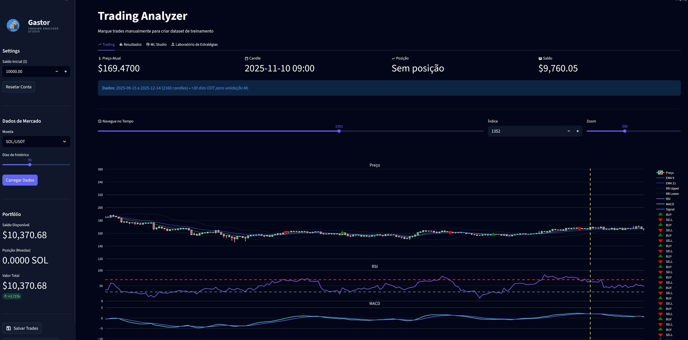
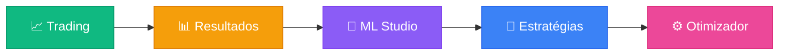
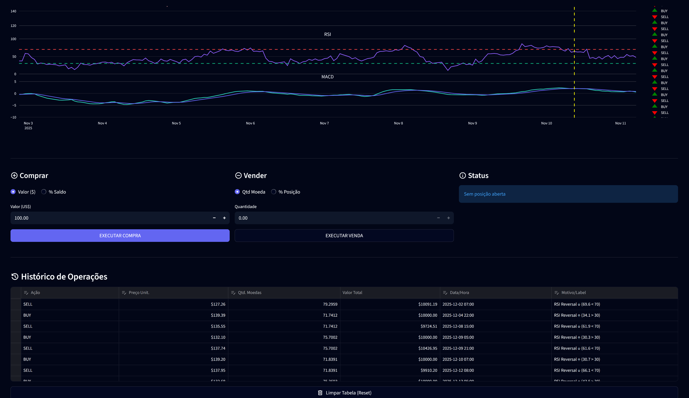
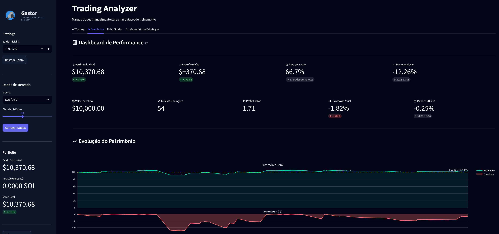
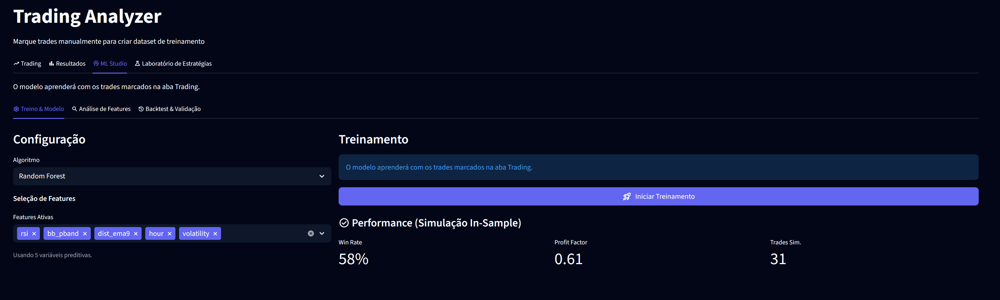
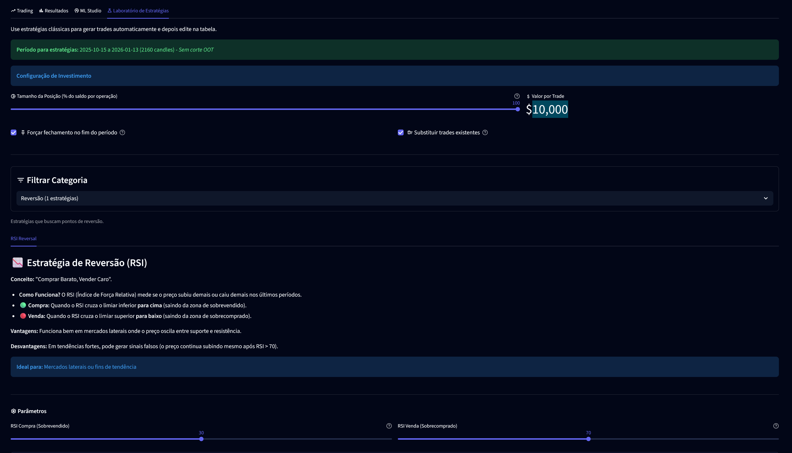

# 📊 Gastor - Trading Analysis & ML Platform

> **Sistema híbrido de trading que combina intuição humana com Machine Learning**

Gastor é uma plataforma completa de análise de trading onde você **ensina** o sistema marcando trades manualmente, e ele **aprende** seus padrões usando ML para aplicar em dados futuros.



---

## 🧠 Conceito: Human-in-the-Loop AI

O diferencial do Gastor é o conceito **"Human-in-the-Loop"**: em vez de usar regras fixas, o sistema aprende com **suas decisões**.

```mermaid
flowchart LR
    subgraph VOCE [" "]
        A["📊 Analisa Gráfico"] --> B["✍️ Marca Trades"]
    end
    
    subgraph ML [" "]
        C["🔍 Extrai Features"] --> D["📈 Treina Modelo"]
        D --> E["💡 Aprende Padrões"]
    end
    
    subgraph RESULTADO [" "]
        F["🧪 Backtest OOT"] --> G["✅ Valida"]
        G --> H["🤖 Prevê Trades"]
    end
    
    B --> C
    E --> F
    
    style A fill:#10b981,stroke:#059669,color:#fff
    style B fill:#10b981,stroke:#059669,color:#fff
    style C fill:#8b5cf6,stroke:#7c3aed,color:#fff
    style D fill:#8b5cf6,stroke:#7c3aed,color:#fff
    style E fill:#8b5cf6,stroke:#7c3aed,color:#fff
    style F fill:#f59e0b,stroke:#d97706,color:#fff
    style G fill:#f59e0b,stroke:#d97706,color:#fff
    style H fill:#f59e0b,stroke:#d97706,color:#fff
```



**👤 Verde = Você** → **🧠 Roxo = ML** → **🎯 Laranja = Resultado**

### Como funciona na prática:

1. **📊 Você analisa** o gráfico de candlestick com indicadores (EMA, RSI, Bollinger)
2. **✍️ Você marca** trades clicando em "COMPRAR" ou "VENDER" nos pontos que considera ideais
3. **🧠 O ML aprende** os padrões por trás das suas decisões (quais indicadores você estava olhando?)
4. **📈 O sistema valida** a estratégia em dados futuros (Out-of-Time) que você nunca viu
5. **🤖 O modelo prevê** onde comprar/vender em novos dados


### 🚫 O que o Gastor NÃO é

Para alinhar expectativas, é importante definir o escopo do projeto:

| NÃO É ❌ | É ✅ |
|----------|------|
| Um robô de execução automática ("Black Box") | Uma **plataforma de pesquisa** (Research) |
| Um sistema de recomendação financeira | Uma ferramenta de **aprendizado supervisionado** |
| Um oráculo previsor de preço | Um sistema probabilístico baseado em **seus dados** |

> **Objetivo:** O Gastor não opera por você. Ele amplifica sua capacidade de análise permitindo testar se sua intuição resiste a dados estatísticos.

---

## 🎯 Para que servem os Trades Manuais?

Os botões **COMPRAR** e **VENDER** na aba Trading criam o **dataset de treinamento** para o ML:

**Em resumo:**
- 🟢 **Trades manuais** = Gabarito para o ML
- 🟣 **ML Studio** = Aprende o padrão dos seus trades
- 🟡 **Modelo Treinado** = Prevê novos trades automaticamente

---

## 🎓 Por que usar o Gastor? (Valor Educacional)

Mais do que uma ferramenta de trading, este projeto é um laboratório prático para:

*   🤖 **Aprender ML Financeiro:** Entenda na prática como algoritmos (Random Forest, XGBoost) "enxergam" o mercado.
*   📉 **Visualizar Overfitting:** Veja como estratégias que parecem perfeitas no passado falham no Out-of-Time.
*   🧠 **Identificar Viés Cognitivo:** Compare sua performance manual vs a do modelo para descobrir onde você hesita ou se precipita.
*   ⚖️ **Humano vs Máquina:** Teste a hipótese do "Centauro" (Humano + AI > Humano ou AI sozinhos).

---

## 🚀 Instalação

```bash
# Clone e configure
git clone https://github.com/Iquitim/Gastor.git
cd gastor

# Ambiente virtual
python -m venv venv
source venv/bin/activate  # Linux/Mac
# venv\Scripts\activate   # Windows

# Dependências
pip install -r requirements.txt

# Execute
streamlit run app.py
```

Acesse em `http://localhost:8501`

---

## 📡 Fontes de Dados

O Gastor suporta múltiplas fontes de dados. Escolha na sidebar qual utilizar:

| Fonte | Ícone | Descrição | Limitações |
|-------|-------|-----------|------------|
| **Automático** | 🔄 | Tenta todas as fontes até uma funcionar | - |
| **CCXT (Binance)** | 🟡 | Exchange Binance via CCXT - Melhor qualidade | Bloqueado em algumas regiões |
| **CCXT (BinanceUS)** | 🇺🇸 | Exchange BinanceUS - Funciona em mais regiões | Menos pares disponíveis |
| **CoinGecko** | 🦎 | Agregador gratuito sem restrições geográficas | 30 calls/min, dados menos granulares |
| **CryptoCompare** | 📊 | API gratuita robusta | 100k calls/mês |

> 💡 **Dica:** Use **Automático** para que o sistema escolha a melhor fonte disponível. Se estiver em uma região com restrições (como Hugging Face Spaces), o sistema automaticamente usa BinanceUS ou CoinGecko.

---

## 🌍 O Desafio das Prop Firms (FTMO)

### O que são Prop Firms?
**Proprietary Trading Firms** (Mesas Proprietárias) são empresas que disponibilizam seu próprio capital para traders operarem. Em vez de arriscar seu dinheiro, você opera o dinheiro da empresa e fica com a maior parte do lucro (geralmente **80-90%**).

Para acessar esse capital, você precisa passar por um **Challenge** (teste) rigoroso que prova sua consistência e gestão de risco.

### Por que FTMO?
A **[FTMO](https://ftmo.com)** é líder global e amplamente considerada uma das prop firms mais sólidas e confiáveis do mercado.
- 🏢 **Reputação:** Paga seus traders consistentemente desde 2015 via transferência bancária ou cripto.
- ⚖️ **Regras Claras:** Sem "pegadinhas" ocultas. Limites de drawdown e perda diária bem definidos.
- 📈 **Escalabilidade:** Planos de crescimento (Scaling Plan) que aumentam o capital sob gestão.

### O Papel do GASTOR
O **Gastor** foi desenhado com o **FTMO Challenge** em mente. O sistema verifica automaticamente se suas estratégias passariam no teste, monitorando em tempo real:
- ✅ Se o lucro atinge a meta (+10%)
- ✅ Se o Drawdown respeita o limite (-10%)
- ✅ Se a perda diária não excede o permitido (-5%)

---

## 📱 As 5 Abas da Interface



---

### 1. 📈 Trading (Análise e Marcação)

A aba principal onde você analisa gráficos e marca trades:


| Funcionalidade | Descrição |
|----------------|-----------|
| **Gráfico Candlestick** | Interativo com zoom, pan e hover |
| **Indicadores** | EMA (9, 21), RSI (14), Bollinger (20, 2) |
| **Botões COMPRAR/VENDER** | Cria trades manuais para treinar o ML |
| **Histórico de Trades** | Lista editável com todas as operações |
| **Navegação Temporal** | Slider para percorrer o histórico |



> **💡 Dica:** Marque trades em pontos onde você *teria* comprado/vendido. O ML vai aprender seu estilo!

---

### 2. 📊 Resultados (Dashboard de Performance)

Dashboard completo com métricas de trading e comparativo FTMO:



**Comparativo FTMO Challenge:**

| Regra | Limite | Descrição |
|-------|--------|-----------|
| Meta de Lucro | **+10%** | Atingir 10% de lucro |
| Max Drawdown | **-10%** | Patrimônio não pode cair mais de 10% |
| Max Loss Diária | **-5%** | Perda máxima em um único dia |
| Dias de Trading | **4** | Mínimo de dias com operações |

---

### 3. 🧠 ML Studio (Treinamento de Modelos)

Onde a mágica acontece! O ML aprende seus padrões:



| Algoritmo | Descrição |
|-----------|-----------|
| **Random Forest** | Robusto, bom para começar |
| **XGBoost** | Mais preciso, requer ajuste |
| **LightGBM** | Rápido, bom para grandes datasets |

**Metodologia de Validação (OOT vs Split Tradicional):**

> ⚠️ **Diferença Importante:** O Gastor não usa divisão aleatória (70/30) para validar o modelo.
> 1. **Treino:** O modelo usa **100% dos seus trades manuais** para aprender o padrão com máxima eficácia.
> 2. **Validação:** A prova real acontece no **Out-of-Time (OOT)**. Os últimos 30 dias de dados são **ocultos** (blind) durante o treino e usados apenas para testar se a estratégia funciona em "dados futuros". Isso simula a realidade do mercado e evita vício (overfitting).

---

### 4. 🧪 Laboratório de Estratégias

10 estratégias clássicas pré-configuradas:



| Categoria | Estratégias |
|-----------|-------------|
| 📈 Tendência | Golden Cross, Trend Following |
| 🔄 Reversão | RSI Reversal |
| ⚡ Momentum | MACD Crossover |
| 🔗 Híbridas | EMA+RSI, MACD+RSI |
| 🚀 Breakout | Donchian, Volume |
| 🎢 Outras | Stochastic RSI, Bollinger Bounce |

---

#### 🏆 Estratégia em Destaque: RSI Reversal

> **Campeã do Otimizador** - Melhor performance validada em 90 dias de dados


| Métrica | Resultado |
|---------|-----------|
| **Lucro Total** | +10.36% ✅ |
| **Win Rate** | 70.6% |
| **Max Drawdown** | 9.27% ✅ |
| **Trades** | 17 |

**Configuração Campeã:**
- `rsi_buy=20, rsi_sell=60`
- Modo: Juros Compostos + Volatilidade ATR

> 💡 Esta configuração passou no **FTMO Challenge**: atingiu a meta de +10% com drawdown abaixo de 10%.

---

**Funcionalidades Avançadas:**

| Recurso | Descrição |
|---------|----------|
| **Juros Compostos** | Reinveste lucros automaticamente |
| **Sizing por ATR** | Ajusta tamanho da posição pela volatilidade |
| **Sizing por RSI** | Posições maiores em oversold extremo |
| **Force Close** | Fecha posições abertas no fim do período |

---

### 5. ⚙️ Otimizador de Estratégias (NOVO!)

Grid Search automático para encontrar os melhores parâmetros:

| Funcionalidade | Descrição |
|----------------|-----------|
| **Grid Search** | Testa todas as combinações de parâmetros |
| **Otimização de Execução** | Testa Juros Compostos + Sizing Dinâmico |
| **Ranking Automático** | Ordena por PnL, Win Rate ou Drawdown |
| **Aplicar Campeã** | Um clique para usar a melhor configuração |

**Métricas calculadas:**
- Total PnL %
- Win Rate %
- Max Drawdown %
- Total de Trades

---

## 🏗️ Arquitetura

```
gastor/
├── app.py                      # Entry point
├── trades.json                 # Trades persistidos
├── requirements.txt            # Dependências
│
├── src/
│   ├── data_manager.py         # Ingestão de dados (CCXT/Binance)
│   │
│   ├── core/                   # Lógica de negócio
│   │   ├── config.py           # Taxas por moeda (slippage dinâmico)
│   │   ├── portfolio.py        # Gestão de portfólio + Risk Management
│   │   ├── indicators.py       # Indicadores técnicos
│   │   ├── charting.py         # Gráficos Plotly
│   │   ├── data_loader.py      # Carregamento de dados
│   │   ├── data_fetchers.py    # APIs: CoinGecko, CryptoCompare (NOVO!)
│   │   └── ml.py               # Machine Learning
│   │
│   ├── ui/                     # Interface Streamlit
│   │   ├── sidebar.py          # Barra lateral
│   │   ├── tab_trading.py      # Aba Trading
│   │   ├── tab_results.py      # Aba Resultados + FTMO
│   │   ├── tab_ml_studio.py    # Aba ML
│   │   ├── tab_strategies.py   # Aba Estratégias
│   │   └── tab_optimizer.py    # Aba Otimizador (NOVO!)
│   │
│   └── strategies/             # 10 estratégias modulares
│       ├── base.py
│       ├── golden_cross.py
│       ├── rsi_reversal.py
│       ├── macd_crossover.py
│       └── ...
│
└── tests/                      # Testes de Estresse
    └── stress/
        └── test_rsi_reversal.py  # Valida estratégias em múltiplos períodos
```

---

## 💰 Taxas Configuráveis

| Moeda | Exchange | Slippage | **Total** |
|-------|----------|----------|-----------|
| BTC/USDT | 0.10% | 0.10% | **0.20%** |
| ETH/USDT | 0.10% | 0.12% | **0.22%** |
| SOL/USDT | 0.10% | 0.15% | **0.25%** |
| DOGE/USDT | 0.10% | 0.20% | **0.30%** |
| AVAX/USDT | 0.10% | 0.25% | **0.35%** |

---

## 🧩 Adicionando Novas Estratégias

```python
from .base import BaseStrategy

class MinhaStrategy(BaseStrategy):
    name = "Minha Estratégia"
    slug = "minha_estrategia"
    category = "momentum"
    icon = "🎯"
    
    def apply(self, df, **params):
        trades = []
        # Sua lógica aqui
        return trades
```

---

## 🔥 Stress Testing

Valide suas estratégias em múltiplos períodos antes de arriscar dinheiro real:

```bash
# Da raiz do projeto
source venv/bin/activate
python tests/stress/test_rsi_reversal.py
```

**O que o teste faz:**
1. Roda a estratégia em 4 períodos (90, 120, 180, 365 dias)
2. Calcula métricas de cada período
3. Avalia se passaria no FTMO Challenge
4. Gera recomendação automática

**Exemplo de saída:**
```
Período                   PnL %   Win Rate     Max DD   Trades
------------------------------------------------------------
90 dias (curto)         +10.36%      70.6%     -9.27%       17
120 dias (médio)        +17.36%      66.7%     -9.27%       27
180 dias (longo)         +7.17%      62.9%    -16.17%       35
365 dias (1 ano)        -21.98%      61.3%    -40.70%       62
```

---

## 📦 Stack

| Categoria | Tecnologia |
|-----------|------------|
| Frontend | Streamlit |
| Gráficos | Plotly |
| ML | Scikit-Learn, XGBoost, LightGBM |
| Dados | Pandas, NumPy |
| Exchange | CCXT (Binance) |

---

## 🪙 Moedas Suportadas

`SOL/USDT` • `ETH/USDT` • `BTC/USDT` • `XRP/USDT` • `AVAX/USDT` • `DOGE/USDT`

---

## 📄 Licença

Este projeto está licenciado sob a **Licença MIT** - veja o arquivo [LICENSE](LICENSE) para detalhes.

[](https://opensource.org/licenses/MIT)

**Você é livre para:**
- ✅ Usar comercialmente
- ✅ Modificar
- ✅ Distribuir
- ✅ Uso privado

**Sob as seguintes condições:**
- Incluir a notificação de copyright e licença em todas as cópias.
