# 📊 Gastor - Algorithmic Trading & Backtesting Platform

> **Plataforma avançada para desenvolvimento, teste e otimização de estratégias de trading.**

Gastor é um ecossistema completo para traders quantitativos que desejam validar suas hipóteses com rigor estatístico antes de arriscar capital real.


---

## 🧠 Conceito: Dados > Intuição

O diferencial do Gastor é o foco em **evidência estatística**. Em vez de operar baseado em "feeling", você constrói regras lógicas e as submete a testes massivos em dados históricos.

### Workflow:

1. **🧪 Laboratório**: Escolha estratégias clássicas (RSI, MACD, Bollinger) ou crie a sua.
2. **⚙️ Otimizador**: Use Grid Search para encontrar os parâmetros ideais (ex: Qual o melhor período para o RSI?).
3. **📊 Validação**: Teste a estratégia otimizada em dados "Out-of-Sample" para evitar overfitting.
4. **🚀 Execução**: (Em breve) Automatize a execução via API.

---

## 🎯 Por que usar o Gastor?

*   📉 **Visualizar Overfitting:** Veja como estratégias que parecem perfeitas no passado falham em novos dados.
*   ⚡ **Otimização Rápida:** Teste milhares de combinações de parâmetros em segundos.
*   🧱 **Construtor Visual:** Crie estratégias complexas sem escrever código (No-Code).
*   ✅ **Validação FTMO:** Verifique automaticamente se sua estratégia passaria nas regras de Mesa Proprietária.

---

### ⚡ Instalação Rápida (Docker)
A maneira mais fácil de rodar o projeto completo (Frontend + Backend + Banco de Dados):

```bash
docker compose up --build
```

Acesse:
- **Frontend:** http://localhost
- **API Docs:** http://localhost:8000/docs

### ☢️ Limpeza Total (Reset Docker)
Se precisar zerar tudo (containers, volumes e imagens) e recomeçar do zero:

```bash
chmod +x nuke_docker.sh
./nuke_docker.sh
```
Isso remove TODOS os resíduos do Docker para garantir um ambiente limpo. Para subir novamente, use o `docker compose up --build`.

### 🛠️ Instalação Manual (Desenvolvimento)

#### Backend (API)
```bash
cd backend
python -m venv venv
source venv/bin/activate  # ou venv\Scripts\activate no Windows
pip install -r requirements.txt
uvicorn main:app --reload
```

#### Frontend (Interface)
```bash
cd frontend
npm install
npm run dev
```

---

## 📡 Fontes de Dados

O Gastor suporta múltiplas fontes de dados. Escolha na sidebar qual utilizar:

| Fonte | Ícone | Descrição | Limitações |
|-------|-------|-----------|------------|
| **Automático** | 🔄 | Tenta todas as fontes até uma funcionar | - |
| **CCXT (Binance)** | 🟡 | Exchange Binance via CCXT - Melhor qualidade | Bloqueado em algumas regiões |
| **CCXT (BinanceUS)** | 🇺🇸 | Exchange BinanceUS - Funciona em mais regiões | Menos pares disponíveis |
| **CoinGecko** | 🦎 | Agregador gratuito sem restrições geográficas | 30 calls/min, dados menos granulares |
| **CryptoCompare** | 📊 | API gratuita robusta | 100k calls/mês |

> 💡 **Dica:** Use **Automático** para que o sistema escolha a melhor fonte disponível. Se estiver em uma região com restrições (como Hugging Face Spaces), o sistema automaticamente usa BinanceUS ou CoinGecko.

---

## 🌍 O Desafio das Prop Firms (FTMO)

### O que são Prop Firms?
**Proprietary Trading Firms** (Mesas Proprietárias) são empresas que disponibilizam seu próprio capital para traders operarem. Em vez de arriscar seu dinheiro, você opera o dinheiro da empresa e fica com a maior parte do lucro (geralmente **80-90%**).

Para acessar esse capital, você precisa passar por um **Challenge** (teste) rigoroso que prova sua consistência e gestão de risco.

### Por que FTMO?
A **[FTMO](https://ftmo.com)** é líder global e amplamente considerada uma das prop firms mais sólidas e confiáveis do mercado.
- 🏢 **Reputação:** Paga seus traders consistentemente desde 2015 via transferência bancária ou cripto.
- ⚖️ **Regras Claras:** Sem "pegadinhas" ocultas. Limites de drawdown e perda diária bem definidos.
- 📈 **Escalabilidade:** Planos de crescimento (Scaling Plan) que aumentam o capital sob gestão.

### O Papel do GASTOR
O **Gastor** foi desenhado com o **FTMO Challenge** em mente. O sistema verifica automaticamente se suas estratégias passariam no teste, monitorando em tempo real:
- ✅ Se o lucro atinge a meta (+10%)
- ✅ Se o Drawdown respeita o limite (-10%)
- ✅ Se a perda diária não excede o permitido (-5%)

---

## 📱 As 9 Abas da Interface

```mermaid
graph LR
    A["📈 Trading"] --> B["📊 Resultados"]
    B --> C["🧪 Laboratório"]
    C --> D["⚙️ Otimizador"]
    D --> E["🛠️ Construtor"]
    E --> F["🎮 Paper Trading"]
    F --> G["📚 Glossário"]
    G --> H["⚙️ Config"]
    
    style A fill:#10b981,stroke:#059669,color:#fff
    style B fill:#f59e0b,stroke:#d97706,color:#fff
    style C fill:#8b5cf6,stroke:#7c3aed,color:#fff
    style D fill:#3b82f6,stroke:#2563eb,color:#fff
    style E fill:#ec4899,stroke:#db2777,color:#fff
    style F fill:#22c55e,stroke:#16a34a,color:#fff
    style G fill:#14b8a6,stroke:#0d9488,color:#fff
    style H fill:#6366f1,stroke:#4f46e5,color:#fff
```



---

### 1. 📈 Trading (Análise e Marcação)

A aba principal onde você analisa gráficos e marca trades:


| Funcionalidade | Descrição |
|----------------|-----------|
| **Gráfico Candlestick** | Interativo com zoom, pan e hover |
| **Indicadores** | EMA (9, 21), RSI (14), Bollinger (20, 2) |
| **Timeframes** | 1m, 5m, 15m, 1h, 4h, 1d |
| **Histórico de Trades** | Lista editável com todas as operações |
| **Navegação Temporal** | Slider para percorrer o histórico |

> **💡 Dica:** Use os botões de compra e venda para simular operações manuais e ver como elas performariam.

---

### 2. 📊 Resultados (Dashboard de Performance)

Dashboard completo com métricas de trading e comparativo FTMO:


**Comparativo FTMO Challenge:**

| Regra | Limite | Descrição |
|-------|--------|-----------|
| Meta de Lucro | **+10%** | Atingir 10% de lucro |
| Max Drawdown | **-10%** | Patrimônio não pode cair mais de 10% |
| Max Loss Diária | **-5%** | Perda máxima em um único dia |
| Dias de Trading | **4** | Mínimo de dias com operações |

---

### 3. 🧪 Laboratório de Estratégias

10 estratégias clássicas pré-configuradas:


| Categoria | Estratégias |
|-----------|-------------|
| 📈 Tendência | Golden Cross, Trend Following |
| 🔄 Reversão | RSI Reversal |
| ⚡ Momentum | MACD Crossover |
| 🔗 Híbridas | EMA+RSI, MACD+RSI |
| 🚀 Breakout | Donchian, Volume |
| 🎢 Outras | Stochastic RSI, Bollinger Bounce |

---

#### 🏆 Estratégia em Destaque: RSI Reversal

> **Campeã do Otimizador** — Testada em **SOL/USDT** | ⏱️ **1h** | últimos **90 dias** (ref: 27/01/27)

| Métrica | Resultado |
|---------|-----------|
| **Lucro Total** | +5.05% |
| **Win Rate** | 68.4% |
| **Max Drawdown** | 9.27% |
| **Pares (BUY+SELL)** | 19 ✅ |

**Configuração Campeã:**
- `rsi_buy=20, rsi_sell=60`
- Modo: Juros Compostos + Volatilidade ATR
- Filtro: Mínimo 6 pares (significância estatística)

> 💡 **Dica:** Use o filtro "Mínimo de Pares" no otimizador. Estratégias com poucos trades (1-3) podem ter win rate artificialmente alto.

---

**Funcionalidades Avançadas:**

| Recurso | Descrição |
|---------|----------|
| **Juros Compostos** | Reinveste lucros automaticamente |
| **Sizing por ATR** | Ajusta tamanho da posição pela volatilidade |
| **Sizing por RSI** | Posições maiores em oversold extremo |
| **Force Close** | Fecha posições abertas no fim do período |

---

### 4. ⚙️ Otimizador de Estratégias

Grid Search automático para encontrar os melhores parâmetros:

| Funcionalidade | Descrição |
|----------------|-----------|
| **Grid Search** | Testa todas as combinações de parâmetros |
| **Otimização de Execução** | Testa Juros Compostos + Sizing Dinâmico |
| **Filtro de Mínimo de Pares** | Ignora estratégias com poucos trades (evita overfitting) |
| **Ranking Automático** | Ordena por PnL, Win Rate ou Drawdown |
| **Aviso de Significância** | Alerta quando campeã tem ≤3 pares |
| **Aplicar Campeã** | Um clique para usar a melhor configuração |

**Métricas calculadas:**
- Total PnL %
- Win Rate %
- Max Drawdown %
- Total de Pares (BUY+SELL completos)

> ⚠️ **Importante:** Resultados são reprodutíveis (seed fixo no sampling). Apenas trades completos são contados (sem force_close na avaliação).

---

### 5. 🛠️ Construtor de Estratégias

Crie suas próprias estratégias personalizadas combinando regras e indicadores:

| Funcionalidade | Descrição |
|----------------|-----------|
| **27 Indicadores** | RSI, EMA, SMA, Bollinger, MACD, ATR, Z-Score, Stochastic e mais |
| **Grupos Aninhados** | Combine regras com lógica AND/OR em múltiplos grupos |
| **Preview em Tempo Real** | Visualize a regra em linguagem natural (ex: "RSI(14) < 30") |
| **Persistência** | Salve, carregue e gerencie suas estratégias personalizadas |

**Exemplo de Estratégia Complexa:**
```
COMPRAR quando:
  (RSI(14) < 30 AND Preço < Bollinger_Lower)
  OR
  (MACD > Signal AND Volume > Volume_MA)
```

**Indicadores Disponíveis:**

| Categoria | Indicadores |
|-----------|-------------|
| Osciladores | RSI, Stochastic, MACD, ROC |
| Médias | EMA, SMA, WMA, VWAP |
| Volatilidade | ATR, Bollinger %B, Desvio Padrão |
| Estatísticos | Z-Score, Z-Score Robusto, MAD |
| Preço | Máximo N Candles, Mínimo N Candles, Fechamento Médio |

---

### 6. 📖 Glossário Interativo (Educação)

Uma enciclopédia completa integrada ao app para aprender trading do zero:

| Recurso | Descrição |
|---------|-----------|
| **Conceitos Básicos** | Explicações didáticas sobre Candles, Timeframes e Mercado |
| **Fórmulas Detalhadas** | Todas as equações matemáticas explicadas elemento por elemento |
| **Analogias** | Comparações do dia a dia para facilitar o entendimento (ex: RSI = corredor cansado) |
| **Categorias** | Médias Móveis, Osciladores, Volatilidade e Termos Gerais |

> 📚 **Objetivo:** Tornar o trading acessível para iniciantes, explicando não apenas "o que" é um indicador, mas "como" ele é calculado e "por que" ele funciona.

---

### 7. ⚙️ Configurações de Taxas

Personalize as taxas de trading usadas nos backtests:

| Funcionalidade | Descrição |
|----------------|-----------|
| **Tabela de Taxas** | Visualize Exchange Fee + Slippage de cada moeda |
| **Editor Global** | Modifique a taxa de exchange (padrão: 0.10%) |
| **Editor por Moeda** | Ajuste o slippage individualmente por ativo |
| **Restaurar Padrões** | Volte aos valores conservadores pré-definidos |

> ⚠️ **Dica:** Taxas mais realistas geram backtests mais confiáveis. Moedas menos líquidas (DOGE, AVAX) têm maior slippage.

---

### 8. 🎮 Paper Trading (Simulação ao Vivo)

Teste suas estratégias com preços reais da Binance sem arriscar dinheiro:

| Funcionalidade | Descrição |
|----------------|-----------|
| **Múltiplas Sessões** | Rode várias estratégias simultaneamente |
| **Preços ao Vivo** | WebSocket conectado à Binance em tempo real |
| **Cálculo de Equity** | PnL considera saldo + valor da posição aberta |
| **Gatilhos Visuais** | Veja em tempo real quais indicadores estão ativos |
| **Depósitos/Saques** | Simule aportes e retiradas virtuais |
| **Notificações Telegram** | Receba alertas de trades no celular |
| **Reset/Delete Rápido** | Gerencie sessões com feedback instantâneo |

**Alocação de Capital:**

> 💡 O sistema utiliza **95% do saldo** para cada compra, reservando 5% para:
> - Taxas de trading (0.1% maker/taker)
> - Slippage em mercados voláteis
> - Margem de segurança para múltiplos trades

**Como usar:**

1. Vá para a aba "Paper Trading"
2. Selecione uma estratégia (pré-pronta ou custom)
3. Clique em "Iniciar" e acompanhe a execução

**Configurando Telegram (Receba alertas no celular):**

```bash
# 1. Crie um bot no @BotFather e copie o token

# 2. Obtenha seu Chat ID via @userinfobot

# 3. Adicione ao arquivo .env na raiz do projeto:
TELEGRAM_BOT_TOKEN=seu_token_aqui
TELEGRAM_DEFAULT_CHAT_ID=seu_chat_id

# 4. Teste com:
cd backend && python test_telegram.py
```

**Notificações incluem:**
- 🟢 Trades de compra (com estratégia, preço, quantidade)
- 🔴 Trades de venda (com PnL realizado)
- 🚀 Início/encerramento de sessões
- 💰 Depósitos e saques
- ⚠️ Erros

> 🎮 **Nota:** O Paper Trading simula ordens - nenhum dinheiro real é envolvido. Perfeito para validar estratégias antes de operar de verdade.

---

## 🏗️ Arquitetura

```
gastor/
├── backend/                    # API FastAPI
│   ├── api/                    # Rotas (Endpoints)
│   ├── core/                   # Lógica de Negócio
│   │   ├── paper_trading/      # Módulo Paper Trading
│   │   │   ├── engine.py       # Motor de execução
│   │   │   ├── strategies.py   # Cálculo de triggers
│   │   │   └── signals.py      # Avaliação de sinais
│   │   ├── indicators.py       # Indicadores técnicos
│   │   └── backtest.py         # Motor de backtest
│   ├── strategies/             # Estratégias pré-definidas
│   └── main.py                 # Entry point
│
├── frontend/                   # Next.js Application
│   ├── src/
│   │   ├── app/                # Páginas (Next.js App Router)
│   │   ├── components/         # Componentes React
│   │   ├── lib/                # API Client e Utils
│   │   └── context/            # Global State
│   └── public/                 # Assets (Imagens)
│
└── README.md                   # Documentação
```

---

---

## 💰 Taxas Configuráveis

| Moeda | Exchange | Slippage | **Total** |
|-------|----------|----------|-----------|
| BTC/USDT | 0.10% | 0.10% | **0.20%** |
| ETH/USDT | 0.10% | 0.12% | **0.22%** |
| SOL/USDT | 0.10% | 0.15% | **0.25%** |
| DOGE/USDT | 0.10% | 0.20% | **0.30%** |
| AVAX/USDT | 0.10% | 0.25% | **0.35%** |

---

## 🧩 Adicionando Novas Estratégias

```python
from .base import BaseStrategy

class MinhaStrategy(BaseStrategy):
    name = "Minha Estratégia"
    slug = "minha_estrategia"
    category = "momentum"
    icon = "🎯"
    
    def apply(self, df, **params):
        trades = []
        # Sua lógica aqui
        return trades
```

---

## 🧪 Testes Unitários

Suíte completa de 56 testes para garantir consistência do código:

```bash
# Executar todos os testes
pytest tests/unit/ -v

# Com cobertura
pytest tests/unit/ --cov=src --cov-report=term-missing
```

| Módulo | Testes | Cobertura |
|--------|--------|-----------|
| `test_config.py` | 12 | Taxas e configurações |
| `test_indicators.py` | 18 | RSI, EMA, SMA, ATR, Bollinger, MACD |
| `test_portfolio.py` | 11 | Sanitização, amounts, gestão de risco |
| `test_strategies.py` | 15 | Todas as 12 estratégias |

---

## 🔥 Stress Testing

Valide suas estratégias em múltiplos períodos antes de arriscar dinheiro real:

```bash
# Da raiz do projeto
source venv/bin/activate
python tests/stress/test_rsi_reversal.py
```

**O que o teste faz:**
1. Roda a estratégia em 4 períodos (90, 120, 180, 365 dias)
2. Calcula métricas de cada período
3. Avalia se passaria no FTMO Challenge
4. Gera recomendação automática

**Exemplo de saída:**
```
Período                   PnL %   Win Rate     Max DD   Trades
------------------------------------------------------------
90 dias (curto)         +10.36%      70.6%     -9.27%       17
120 dias (médio)        +17.36%      66.7%     -9.27%       27
180 dias (longo)         +7.17%      62.9%    -16.17%       35
365 dias (1 ano)        -21.98%      61.3%    -40.70%       62
```

---

## 🔒 Reprodutibilidade dos Resultados

O Gastor foi projetado para gerar **resultados consistentes** independente do dia que você rodar:

### 🛡️ Rigor na Configuração (Sem "Chutes")

O Backend opera com política de **Tolerância Zero** para configurações padrão implícitas. Isso garante reprodutibilidade total:
*   **Nada é assumido:** O Frontend DEVE enviar explicitamente `initial_balance`, `use_compound`, `include_fees` e `fee_rate` em TODAS as requisições.
*   **Validação Estrita:** Se faltar qualquer parâmetro, o sistema rejeita a operação (Erro 422), impedindo que simulações rodem com valores padrão incorretos.

### 💰 PnL Realizado (Money in the Pocket)
*   **Realized Only:** Todas as métricas de PnL (Lucro/Prejuízo) consideram APENAS trades **fechados**. Ganhos não realizados (posições abertas) não entram na conta final, simulando o saldo real disponível para saque.

### Garantias Implementadas

| Problema Evitado | Solução |
|------------------|---------|
| Amostragem aleatória diferente | `random.seed(42)` fixo no grid search |
| Posições abertas fechadas no preço atual | `force_close=False` na avaliação (só trades completos) |
| Win rate inflado por poucos trades | Filtro de "Mínimo de Pares" + aviso automático |
| Indicadores usando dados futuros | Todos usam `rolling()` e `shift(1)` (olham para trás) |

### O que NÃO causa data leak:

- **Indicadores** (RSI, EMA, Bollinger, MACD) - calculados com dados passados apenas
- **Estratégias** - usam `iloc[i-1]` para comparar com candle anterior
- **Separação OOT** - últimos 30 dias reservados e não usados no treino

> ⚠️ **Resultado diferente?** Se rodar em outro dia, os **dados novos** (candles recentes) podem mudar o resultado. Mas rodando no mesmo dia/período, o resultado será idêntico.

---

## 📦 Stack

| Categoria | Tecnologia |
|-----------|------------|
| Frontend | Next.js, React, TailwindCSS, Recharts |
| Backend | FastAPI, Pydantic |
| Dados | Pandas |

---

## 🪙 Moedas Suportadas

`SOL/USDT` • `ETH/USDT` • `BTC/USDT` • `XRP/USDT` • `AVAX/USDT` • `DOGE/USDT`

---

---

## 🛣️ Próximos Passos (Roadmap)

O desenvolvimento do Gastor é contínuo. As próximas etapas planejadas são:

- [x] **Paper Trading**: Simulação de trades com preços ao vivo da Binance. ✅
- [ ] **🔐 Sistema de Autenticação** *(Próxima Prioridade)*
  - Login/Registro com padrões modernos de segurança (bcrypt, JWT, HTTPS)
  - Perfis de usuário com dados isolados
  - Armazenamento seguro de credenciais (tokens Telegram, API Binance)
  - Estratégias personalizadas salvas por usuário
  - Sessões de Paper Trading vinculadas ao perfil
- [ ] **Live Trading Real**: Execução automática em conta real via API Binance.
- [ ] **Stop-Loss Automático**: Gestão de risco integrada nas sessões.
- [ ] **Machine Learning Avançado**: Integração com modelos Deep Learning (LSTMs).
- [ ] **Gestão de Portfólio**: Otimização de alocação entre múltiplas estratégias simultâneas.

---

## 📄 Licença

Este projeto está licenciado sob a **Licença MIT** - veja o arquivo [LICENSE](LICENSE) para detalhes.

[](https://opensource.org/licenses/MIT)

**Você é livre para:**
- ✅ Usar comercialmente
- ✅ Modificar
- ✅ Distribuir
- ✅ Uso privado

**Sob as seguintes condições:**
- Incluir a notificação de copyright e licença em todas as cópias.
