# 📊 Gastor - Trading Analysis & ML Platform

> **Sistema híbrido de trading que combina intuição humana com Machine Learning**

Gastor é uma plataforma completa de análise de trading onde você **ensina** o sistema marcando trades manualmente, e ele **aprende** seus padrões usando ML para aplicar em dados futuros.

---

## 🧠 Conceito: Human-in-the-Loop AI

O diferencial do Gastor é o conceito **"Human-in-the-Loop"**: em vez de usar regras fixas, o sistema aprende com **suas decisões**.

```mermaid
flowchart LR
    subgraph VOCE [" "]
        A["📊 Analisa Gráfico"] --> B["✍️ Marca Trades"]
    end
    
    subgraph ML [" "]
        C["🔍 Extrai Features"] --> D["📈 Treina Modelo"]
        D --> E["💡 Aprende Padrões"]
    end
    
    subgraph RESULTADO [" "]
        F["🧪 Backtest OOT"] --> G["✅ Valida"]
        G --> H["🤖 Prevê Trades"]
    end
    
    B --> C
    E --> F
    
    style A fill:#10b981,stroke:#059669,color:#fff
    style B fill:#10b981,stroke:#059669,color:#fff
    style C fill:#8b5cf6,stroke:#7c3aed,color:#fff
    style D fill:#8b5cf6,stroke:#7c3aed,color:#fff
    style E fill:#8b5cf6,stroke:#7c3aed,color:#fff
    style F fill:#f59e0b,stroke:#d97706,color:#fff
    style G fill:#f59e0b,stroke:#d97706,color:#fff
    style H fill:#f59e0b,stroke:#d97706,color:#fff
```



**👤 Verde = Você** → **🧠 Roxo = ML** → **🎯 Laranja = Resultado**

### Como funciona na prática:

1. **📊 Você analisa** o gráfico de candlestick com indicadores (EMA, RSI, Bollinger)
2. **✍️ Você marca** trades clicando em "COMPRAR" ou "VENDER" nos pontos que considera ideais
3. **🧠 O ML aprende** os padrões por trás das suas decisões (quais indicadores você estava olhando?)
4. **📈 O sistema valida** a estratégia em dados futuros (Out-of-Time) que você nunca viu
5. **🤖 O modelo prevê** onde comprar/vender em novos dados


### 🚫 O que o Gastor NÃO é

Para alinhar expectativas, é importante definir o escopo do projeto:

| NÃO É ❌ | É ✅ |
|----------|------|
| Um robô de execução automática ("Black Box") | Uma **plataforma de pesquisa** (Research) |
| Um sistema de recomendação financeira | Uma ferramenta de **aprendizado supervisionado** |
| Um oráculo previsor de preço | Um sistema probabilístico baseado em **seus dados** |

> **Objetivo:** O Gastor não opera por você. Ele amplifica sua capacidade de análise permitindo testar se sua intuição resiste a dados estatísticos.

---

## 🎯 Para que servem os Trades Manuais?

Os botões **COMPRAR** e **VENDER** na aba Trading criam o **dataset de treinamento** para o ML:

```mermaid
flowchart TB
    T1["🟢 COMPRA @ $150 | RSI=28"]
    T2["🔴 VENDA @ $180 | RSI=72"]
    T3["🟢 COMPRA @ $140 | RSI=25"]
    
    M1["🔬 ML Analisa"]
    M2["💡 RSI < 30 = COMPRA"]
    M3["💡 RSI > 70 = VENDA"]
    
    O1["🤖 Modelo Treinado"]
    
    T1 --> M1
    T2 --> M1
    T3 --> M1
    M1 --> M2
    M1 --> M3
    M2 --> O1
    M3 --> O1
    
    style T1 fill:#10b981,stroke:#059669,color:#fff
    style T2 fill:#ef4444,stroke:#dc2626,color:#fff
    style T3 fill:#10b981,stroke:#059669,color:#fff
    style M1 fill:#8b5cf6,stroke:#7c3aed,color:#fff
    style M2 fill:#8b5cf6,stroke:#7c3aed,color:#fff
    style M3 fill:#8b5cf6,stroke:#7c3aed,color:#fff
    style O1 fill:#f59e0b,stroke:#d97706,color:#fff
```



**Em resumo:**
- 🟢 **Trades manuais** = Gabarito para o ML
- 🟣 **ML Studio** = Aprende o padrão dos seus trades
- 🟡 **Modelo Treinado** = Prevê novos trades automaticamente

---

---

## 🎓 Por que usar o Gastor? (Valor Educacional)

Mais do que uma ferramenta de trading, este projeto é um laboratório prático para:

*   🤖 **Aprender ML Financeiro:** Entenda na prática como algoritmos (Random Forest, XGBoost) "enxergam" o mercado.
*   📉 **Visualizar Overfitting:** Veja como estratégias que parecem perfeitas no passado falham no Out-of-Time.
*   🧠 **Identificar Viés Cognitivo:** Compare sua performance manual vs a do modelo para descobrir onde você hesita ou se precipita.
*   ⚖️ **Humano vs Máquina:** Teste a hipótese do "Centauro" (Humano + AI > Humano ou AI sozinhos).

---

## 🚀 Instalação

```bash
# Clone e configure
git clone https://github.com/seu-repo/gastor.git
cd gastor

# Ambiente virtual
python -m venv venv
source venv/bin/activate  # Linux/Mac
# venv\Scripts\activate   # Windows

# Dependências
pip install -r requirements.txt

# Execute
streamlit run app.py
```

Acesse em `http://localhost:8501`

---

## 🌍 O Desafio das Prop Firms (FTMO)

### O que são Prop Firms?
**Proprietary Trading Firms** (Mesas Proprietárias) são empresas que disponibilizam seu próprio capital para traders operarem. Em vez de arriscar seu dinheiro, você opera o dinheiro da empresa e fica com a maior parte do lucro (geralmente **80-90%**).

Para acessar esse capital, você precisa passar por um **Challenge** (teste) rigoroso que prova sua consistência e gestão de risco.

### Por que FTMO?
A **[FTMO](https://ftmo.com)** é líder global e amplamente considerada uma das prop firms mais sólidas e confiáveis do mercado.
- 🏢 **Reputação:** Paga seus traders consistentemente desde 2015 via transferência bancária ou cripto.
- ⚖️ **Regras Claras:** Sem "pegadinhas" ocultas. Limites de drawdown e perda diária bem definidos.
- 📈 **Escalabilidade:** Planos de crescimento (Scaling Plan) que aumentam o capital sob gestão.

### O Papel do GASTOR
O **Gastor** foi desenhado com o **FTMO Challenge** em mente. O sistema verifica automaticamente se suas estratégias passariam no teste, monitorando em tempo real:
- ✅ Se o lucro atinge a meta (+10%)
- ✅ Se o Drawdown respeita o limite (-10%)
- ✅ Se a perda diária não excede o permitido (-5%)

---

## 📱 As 4 Abas da Interface

```mermaid
graph LR
    A["📈 Trading"] --> B["📊 Resultados"]
    B --> C["🧠 ML Studio"]
    C --> D["🧪 Estratégias"]
    
    style A fill:#10b981,stroke:#059669,color:#fff
    style B fill:#f59e0b,stroke:#d97706,color:#fff
    style C fill:#8b5cf6,stroke:#7c3aed,color:#fff
    style D fill:#3b82f6,stroke:#2563eb,color:#fff
```



---

### 1. 📈 Trading (Análise e Marcação)

A aba principal onde você analisa gráficos e marca trades:

| Funcionalidade | Descrição |
|----------------|-----------|
| **Gráfico Candlestick** | Interativo com zoom, pan e hover |
| **Indicadores** | EMA (9, 21), RSI (14), Bollinger (20, 2) |
| **Botões COMPRAR/VENDER** | Cria trades manuais para treinar o ML |
| **Histórico de Trades** | Lista editável com todas as operações |
| **Navegação Temporal** | Slider para percorrer o histórico |

> **💡 Dica:** Marque trades em pontos onde você *teria* comprado/vendido. O ML vai aprender seu estilo!

---

### 2. 📊 Resultados (Dashboard de Performance)

Dashboard completo com métricas de trading e comparativo FTMO:

```mermaid
flowchart LR
    subgraph DASH [" "]
        M1["💰 Patrimônio Total"] 
        M2["📈 Lucro Líquido"]
        M3["🎯 Taxa de Acerto"]
        M4["▼ Máximo Drawdown"]
    end
    
    subgraph FTMO [" "]
        F1["✅ Meta +10%"]
        F2["✅ Max DD -10%"]
        F3["✅ Daily -5%"]
    end
    
    M1 --> F1
    M4 --> F2
    
    style M1 fill:#10b981,stroke:#059669,color:#fff
    style M2 fill:#10b981,stroke:#059669,color:#fff
    style M3 fill:#3b82f6,stroke:#2563eb,color:#fff
    style M4 fill:#ef4444,stroke:#dc2626,color:#fff
    style F1 fill:#f59e0b,stroke:#d97706,color:#fff
    style F2 fill:#f59e0b,stroke:#d97706,color:#fff
    style F3 fill:#f59e0b,stroke:#d97706,color:#fff
```



**Comparativo FTMO Challenge:**

| Regra | Limite | Descrição |
|-------|--------|-----------|
| Meta de Lucro | **+10%** | Atingir 10% de lucro |
| Max Drawdown | **-10%** | Patrimônio não pode cair mais de 10% |
| Max Loss Diária | **-5%** | Perda máxima em um único dia |
| Dias de Trading | **4** | Mínimo de dias com operações |

---

### 3. 🧠 ML Studio (Treinamento de Modelos)

Onde a mágica acontece! O ML aprende seus padrões:

```mermaid
flowchart LR
    T["📁 Trades"] --> F["🔍 Features"]
    F --> M["🧠 Modelo"]
    M --> B["🧪 Backtest"]
    B --> R["📊 Métricas"]
    
    style T fill:#10b981,stroke:#059669,color:#fff
    style F fill:#3b82f6,stroke:#2563eb,color:#fff
    style M fill:#8b5cf6,stroke:#7c3aed,color:#fff
    style B fill:#f59e0b,stroke:#d97706,color:#fff
    style R fill:#10b981,stroke:#059669,color:#fff
```



| Algoritmo | Descrição |
|-----------|-----------|
| **Random Forest** | Robusto, bom para começar |
| **XGBoost** | Mais preciso, requer ajuste |
| **LightGBM** | Rápido, bom para grandes datasets |

**Metodologia de Validação (OOT vs Split Tradicional):**

> ⚠️ **Diferença Importante:** O Gastor não usa divisão aleatória (70/30) para validar o modelo.
> 1. **Treino:** O modelo usa **100% dos seus trades manuais** para aprender o padrão com máxima eficácia.
> 2. **Validação:** A prova real acontece no **Out-of-Time (OOT)**. Os últimos 30 dias de dados são **ocultos** (blind) durante o treino e usados apenas para testar se a estratégia funciona em "dados futuros". Isso simula a realidade do mercado e evita vício (overfitting).

**Target Labeling (Imitation Learning):**

> Diferente de sistemas tradicionais que usam janelas fixas (ex: "subiu 2% em 20 candles"), o Gastor utiliza **Rótulos Definidos pelo Trader (Human-Defined Labels)**.
>
> *   **Abordagem:** O alvo (target) é a sua decisão explícita de entrada.
> *   **Objetivo:** O ML atua como um sistema de **Imitation Learning**, aprendendo a replicar os setups que *você* identificou como válidos.
> *   **Horizonte:** O horizonte de retorno é implícito na sua análise discricionária, permitindo capturar setups complexos que regras fixas de tempo perderiam.

---

### 4. 🧪 Laboratório de Estratégias

10 estratégias clássicas pré-configuradas:


| Categoria | Estratégias |
|-----------|-------------|
| 📈 Tendência | Golden Cross, Trend Following |
| 🔄 Reversão | RSI Reversal |
| ⚡ Momentum | MACD Crossover |
| 🔗 Híbridas | EMA+RSI, MACD+RSI |
| 🚀 Breakout | Donchian, Volume |
| 🎢 Outras | Stochastic RSI, Bollinger Bounce |

---

## 🏗️ Arquitetura

```
gastor/
├── app.py                      # Entry point
├── trades.json                 # Trades persistidos
│
└── src/
    ├── core/                   # Lógica de negócio
    │   ├── config.py           # Taxas por moeda
    │   ├── portfolio.py        # Gestão de portfólio
    │   ├── indicators.py       # Indicadores técnicos
    │   └── ml.py               # Machine Learning
    │
    ├── ui/                     # Interface Streamlit
    │   ├── sidebar.py          # Barra lateral
    │   ├── tab_trading.py      # Aba Trading
    │   ├── tab_results.py      # Aba Resultados + FTMO
    │   ├── tab_ml_studio.py    # Aba ML
    │   └── tab_strategies.py   # Aba Estratégias
    │
    └── strategies/             # 10 estratégias modulares
        ├── base.py
        └── ...
```

---

## 💰 Taxas Configuráveis

| Moeda | Exchange | Slippage | **Total** |
|-------|----------|----------|-----------|
| BTC/USDT | 0.10% | 0.10% | **0.20%** |
| ETH/USDT | 0.10% | 0.12% | **0.22%** |
| SOL/USDT | 0.10% | 0.15% | **0.25%** |
| DOGE/USDT | 0.10% | 0.20% | **0.30%** |
| AVAX/USDT | 0.10% | 0.25% | **0.35%** |

---

## 🧩 Adicionando Novas Estratégias

```python
from .base import BaseStrategy

class MinhaStrategy(BaseStrategy):
    name = "Minha Estratégia"
    slug = "minha_estrategia"
    category = "momentum"
    icon = "🎯"
    
    def apply(self, df, **params):
        trades = []
        # Sua lógica aqui
        return trades
```

---

## 📦 Stack

| Categoria | Tecnologia |
|-----------|------------|
| Frontend | Streamlit |
| Gráficos | Plotly |
| ML | Scikit-Learn, XGBoost, LightGBM |
| Dados | Pandas, NumPy |
| Exchange | CCXT (Binance) |

---

## 🪙 Moedas

`SOL/USDT` • `ETH/USDT` • `BTC/USDT` • `XRP/USDT` • `AVAX/USDT` • `DOGE/USDT`

---

## 📄 Licença

Este projeto está licenciado sob a **Licença MIT** - veja o arquivo [LICENSE](LICENSE) para detalhes.

[](https://opensource.org/licenses/MIT)

**Você é livre para:**
- ✅ Usar comercialmente
- ✅ Modificar
- ✅ Distribuir
- ✅ Uso privado

**Sob as seguintes condições:**
- Incluir a notificação de copyright e licença em todas as cópias.
